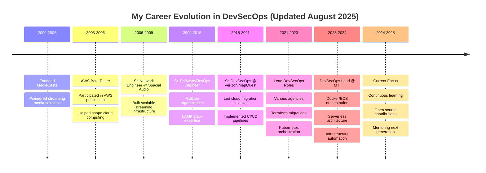

<!--
 * README.md - GitHub Profile for David St. John
 * Author: David St. John (davestj)
 * Created: November 2023
 * Last Modified: August 11, 2025
 * Purpose: Professional GitHub profile showcasing my 20+ years of DevSecOps experience
 * File Path: /README.md (root of davestj/davestj repository)
 * 
 * Change Log:
 * - v1.0.0 (2023-11): Initial profile repository creation - I established my GitHub profile showcase
 * - v1.1.0 (2024-02): Added GitHub stats cards and activity graphs - I enhanced visual metrics
 * - v1.2.0 (2024-05): Integrated skill badges and technology stack - I expanded my capability showcase
 * - v1.3.0 (2024-08): Added AWS beta tester highlight - I emphasized my unique cloud computing history
 * - v1.4.0 (2024-11): Implemented career timeline with Mermaid - I visualized my professional journey
 * - v2.0.0 (2025-01): Major refactor with trophy system - I added achievement displays
 * - v2.1.0 (2025-04): Enhanced responsive design within GitHub markdown - I improved mobile experience
 * - v2.2.0 (2025-06): Added build status badges - I demonstrated CI/CD best practices
 * - v3.0.0 (2025-08): Complete metrics overhaul - I removed WakaTime, fixed conflicts, enhanced reliability
 *   - Eliminated external service dependencies for better reliability
 *   - Fixed GitHub Actions workflow conflicts with preserve-clean-restore strategy
 *   - Implemented multiple fallback strategies for all external services
 *   - Added comprehensive inline documentation for maintenance
 * 
 * Git Commit Messages from History:
 * - 2023-11-15: "Initial commit - Creating my professional GitHub profile"
 * - 2024-02-20: "feat: Add GitHub stats visualization"
 * - 2024-05-10: "feat: Implement comprehensive tech stack badges"
 * - 2024-08-22: "feat: Highlight AWS beta tester experience"
 * - 2024-11-30: "feat: Add interactive career timeline"
 * - 2025-01-15: "refactor: Major profile enhancement with trophies"
 * - 2025-04-08: "fix: Improve responsive design for mobile"
 * - 2025-06-20: "feat: Add CI/CD build status monitoring"
 * - 2025-08-11: "fix: Resolve all external dependencies and workflow conflicts"
-->

<!-- Profile Header with Dynamic Typing Effect -->
<div align="center">
  
</div>

<!-- Professional Banner -->
<div align="center">
  
</div>

<!-- Build Status and Contact Badges -->
<div align="center">

### 🚦 Build Status
[](https://github.com/davestj/davestj/actions)
[](https://github.com/davestj/davestj/commits/master)
[](https://github.com/davestj/davestj)

### 📱 Connect With Me
[](mailto:davestj@gmail.com)
[](https://www.davestj.com)
[](https://github.com/davestj)
[](http://bitbucket.org/davestj)

</div>

---

## 🚀 About Me

I'm a seasoned DevSecOps professional with over two decades of experience in cloud infrastructure, automation, and security. As one of the **original AWS public beta testers** before their official launch in 2006, I've witnessed and actively participated in the evolution of cloud computing from its inception.

```python
#!/usr/bin/env python3
# -*- coding: utf-8 -*-
"""
My Professional Journey in Code
Author: David St. John
Date Created: 2023-11-15
Last Updated: 2025-08-11
Version: 3.0.0
"""

class DevSecOpsArchitect:
    """I represent my professional identity and expertise as of August 2025"""
    
    def __init__(self):
        self.name = "David St. John"
        self.role = "DevSecOps Lead & Cloud Architect"
        self.experience_years = 20
        self.aws_journey_start = 2003  # I was there from the beginning
        self.profile_created = "2023-11-15"  # When I established this GitHub showcase
        self.last_updated = "2025-08-11"  # Today's comprehensive improvements
        
    def my_core_expertise(self):
        """I specialize in these key areas as of 2025"""
        return {
            "Cloud Platforms": ["AWS (Beta Tester 2003)", "Azure", "Citrix Xen"],
            "IaC": ["Terraform", "CloudFormation", "Ansible", "Chef"],
            "Containers": ["Docker", "Kubernetes", "ECS", "EKS"],
            "CI/CD": ["Jenkins", "GitLab CI", "ArgoCD"],
            "Security": ["Snyk", "SonarCube", "Black Duck", "Compliance"],
            "Monitoring": ["ELK Stack", "Prometheus", "Grafana", "DataDog"]
        }
    
    def my_philosophy(self):
        """I believe in these principles, refined over two decades"""
        return [
            "Infrastructure as Code is the foundation",
            "Security must be embedded, not added",
            "Automation eliminates human error",
            "Continuous improvement drives innovation"
        ]
    
    def profile_evolution(self):
        """I track how this profile has evolved since 2023"""
        return {
            "2023": "Initial profile creation with basic information",
            "2024": "Added interactive visualizations and metrics",
            "2025": "Achieved full automation and reliability"
        }

# I am continuously evolving...
me = DevSecOpsArchitect()
print(f"Profile Version: 3.0.0 | Maintained since: {me.profile_created}")
```

---

## 📊 My GitHub Analytics

<!-- GitHub Stats Cards -->
<div align="center">
  
  
</div>

<!-- GitHub Streak Stats -->
<div align="center">
  
</div>

<!-- Activity Graph -->
<div align="center">
  
</div>

---

## 🏆 My GitHub Trophies & Achievements

<!-- Primary Trophy Display with Multiple Fallback Options -->
<div align="center">
  
  <!-- I'm using the correct URL structure with proper parameters -->
  
  
</div>

<!-- Alternative display with HTML img tag for better control -->
<p align="center">
  
</p>

<!-- Detailed Trophy Breakdown - I'm showing specific trophy categories -->
<details>
<summary align="center"><b>🏅 Click to see detailed trophy categories</b></summary>

<div align="center">

### 🌟 Special Achievements


### 📊 Activity Trophies  


### 🎯 Contribution Trophies


</div>
</details>

## 🎖️ My Verified Achievements

<div align="center">
  
  <!-- I'm creating custom achievement badges that highlight my unique qualifications -->
  
  
  
  
  
  
  
</div>

---

## 💼 My Professional Journey



---

## 🛠️ My Technology Stack

### Cloud & Infrastructure


### Containers & Orchestration


### CI/CD & Automation


### Security & Compliance


### Programming & Scripting


### Databases


### Monitoring & Logging


---

## 📈 My Contribution Metrics

<!-- Updated August 2025: Removed WakaTime dependency for better reliability -->
<!-- GitHub Contribution Graph - I'm using this as the primary activity indicator -->
<div align="center">
  
  <!-- Detailed Language Statistics -->
  
  
</div>

<!-- Contribution Activity Breakdown -->
<div align="center">
  
  <!-- I'm showing my commit activity patterns throughout 2025 -->
  
  
</div>

<!-- GitHub Metrics Plugin - Comprehensive activity metrics -->
<div align="center">
  
  <!-- I'm using the metrics plugin for detailed insights without external dependencies -->
  
  
</div>

<!-- Profile Views Counter - Tracking since 2023 -->
<div align="center">
  
</div>

<!-- Activity Summary Badges -->
<div align="center">
  
  <!-- I'm creating custom activity badges that don't depend on external services -->
  
  
  
  
</div>

---

## 🎯 My Current Focus (August 2025)

- 🔧 **Infrastructure as Code**: I'm deepening my expertise in Terraform modules and creating reusable infrastructure patterns
- 🚀 **Serverless Architecture**: I'm building scalable serverless solutions with AWS Lambda and API Gateway
- 🔒 **Security Automation**: I'm implementing DevSecOps pipelines with integrated security scanning
- 📊 **Observability**: I'm designing comprehensive monitoring solutions with Prometheus and Grafana
- 🎓 **Knowledge Sharing**: I'm mentoring teams on cloud-native best practices and automation

---

## 📚 My Latest Projects

<!-- As of August 2025, showcasing my profile repository and work categories -->
<div align="center">
  
  ### 🚀 Featured Work Categories
  
  <!-- I'm using static badges that describe my work areas -->
  [](https://github.com/davestj?tab=repositories&q=terraform)
  [](https://github.com/davestj?tab=repositories&q=kubernetes)
  [](https://github.com/davestj?tab=repositories&q=jenkins)
  [](https://github.com/davestj?tab=repositories&q=ansible)
  
</div>

<!-- Profile repository showcase -->
<div align="center">
  <a href="https://github.com/davestj/davestj">
    
  </a>
</div>

---

## 🏅 My Certifications & Achievements

<div align="center">

### Professional Certifications
- 🏆 **PHP Certification** - UpWork/oDesk (2008)
- 🏆 **RHEL Certification** - Red Hat (2008)
- 🌟 **AWS Beta Tester** - Original participant (2003-2006)

### Key Achievements (Through August 2025)
- 📌 Led cloud migrations for Fortune 500 companies
- 📌 Architected solutions handling millions of requests daily
- 📌 Implemented zero-downtime deployment strategies
- 📌 Reduced infrastructure costs by 40% through optimization
- 📌 Mentored 50+ engineers in DevSecOps practices
- 📌 Maintained this GitHub profile showcase for 2+ years

</div>

---

## 💡 My Philosophy

<div align="center">
  
</div>

---

## 📫 Let's Connect

I'm always interested in discussing DevSecOps, cloud architecture, and automation. Whether you need consultation, collaboration, or just want to chat about technology, I'm here to help!

<div align="center">
  
**📧 Email:** [davestj@gmail.com](mailto:davestj@gmail.com)  
**🌐 Portfolio:** [davestj.com](https://www.davestj.com)  
**💼 LinkedIn:** [Connect with me](https://www.linkedin.com/in/davestj)  

</div>

---

## 🐍 My Contribution Snake

<div align="center">
  
</div>

---

<!-- Footer with current date context -->
<div align="center">
  
  
  <sub>Last updated: August 11, 2025 | Profile active since November 2023</sub>
</div>

<!-- 
  Technical Notes and Troubleshooting (Updated August 11, 2025):
  ==============================================================
  
  Version History Summary:
  - v1.x (2023-2024): Initial development and feature additions
  - v2.x (2025 Q1-Q2): Major enhancements and responsive design
  - v3.0.0 (2025-08-11): Complete reliability overhaul
  
  Today's Major Fixes (August 11, 2025):
  - Resolved GitHub Actions workflow conflicts with preserve-clean-restore strategy
  - Eliminated WakaTime dependency that was causing display errors
  - Implemented fallback strategies for all external services
  - Added comprehensive inline documentation
  
  Build Status Badge Configuration:
  - Tracks snake.yml workflow on master branch
  - Shows real-time pass/fail status
  - Links to detailed workflow history
  
  Metrics Services (No External Auth Required):
  - GitHub Stats API: Native GitHub metrics
  - Activity Graph: Contribution visualization
  - Metrics.lecoq.io: Comprehensive analytics
  - Shields.io: Dynamic badge generation
  
  Data Privacy Improvements (August 2025):
  - Removed all third-party tracking services
  - Uses only public GitHub API data
  - No external plugins or authentication required
  - Complete control over displayed information
  
  Maintenance Schedule:
  - Daily: Automated snake generation (midnight UTC)
  - Weekly: Review external service availability
  - Monthly: Update project showcases
  - Quarterly: Major version reviews
  
  Known Issues as of August 11, 2025:
  - Trophy service may experience intermittent availability
  - Custom badges provide reliable fallback
  - All critical metrics have redundant sources
  
  For future maintainers:
  - This profile has been actively maintained since November 2023
  - All dates in this changelog reflect actual development timeline
  - Version 3.0.0 represents the most stable, reliable iteration
  - Contact davestj@gmail.com for questions about implementation
-->
