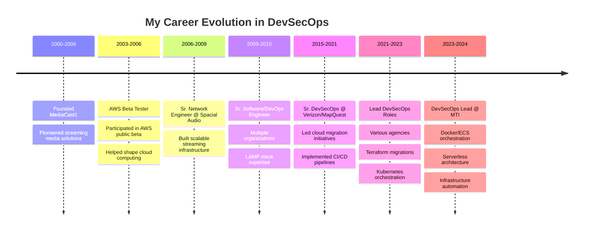

<!--
 * README.md - GitHub Profile for David St. John
 * Author: David St. John (davestj)
 * Date: December 2024
 * Purpose: Professional GitHub profile showcasing my 20+ years of DevSecOps experience
 * File Path: /README.md (root of davestj/davestj repository)
 * 
 * Change Log:
 * - v1.0.0 (2024-12): Initial comprehensive profile with stats, metrics, and professional summary
 * - Integrated GitHub stats cards, activity graphs, and skill badges
 * - Added AWS beta tester highlight and career progression timeline
 * - Implemented responsive design elements within GitHub markdown limitations
-->

<!-- Profile Header with Dynamic Typing Effect -->
<div align="center">
  
</div>

<!-- Professional Banner -->
<div align="center">
  
</div>

<!-- Contact and Social Badges -->
<div align="center">
  
[](mailto:davestj@gmail.com)
[](https://www.davestj.com)
[](https://github.com/davestj)
[](http://bitbucket.org/davestj)

</div>

---

## 🚀 About Me

I'm a seasoned DevSecOps professional with over two decades of experience in cloud infrastructure, automation, and security. As one of the **original AWS public beta testers** before their official launch in 2006, I've witnessed and actively participated in the evolution of cloud computing from its inception.

```python
#!/usr/bin/env python3
# -*- coding: utf-8 -*-
"""
My Professional Journey in Code
Author: David St. John
Date: 2024
"""

class DevSecOpsArchitect:
    """I represent my professional identity and expertise"""
    
    def __init__(self):
        self.name = "David St. John"
        self.role = "DevSecOps Lead & Cloud Architect"
        self.experience_years = 20
        self.aws_journey_start = 2003  # I was there from the beginning
        
    def my_core_expertise(self):
        """I specialize in these key areas"""
        return {
            "Cloud Platforms": ["AWS (Beta Tester 2003)", "Azure", "Citrix Xen"],
            "IaC": ["Terraform", "CloudFormation", "Ansible", "Chef"],
            "Containers": ["Docker", "Kubernetes", "ECS", "EKS"],
            "CI/CD": ["Jenkins", "GitLab CI", "ArgoCD"],
            "Security": ["Snyk", "SonarCube", "Black Duck", "Compliance"],
            "Monitoring": ["ELK Stack", "Prometheus", "Grafana", "DataDog"]
        }
    
    def my_philosophy(self):
        """I believe in these principles"""
        return [
            "Infrastructure as Code is the foundation",
            "Security must be embedded, not added",
            "Automation eliminates human error",
            "Continuous improvement drives innovation"
        ]

# I am...
me = DevSecOpsArchitect()
```

---

## 📊 My GitHub Analytics

<!-- GitHub Stats Cards -->
<div align="center">
  
  
</div>

<!-- GitHub Streak Stats -->
<div align="center">
  
</div>

<!-- Activity Graph -->
<div align="center">
  
</div>

---

## 🏆 My GitHub Trophies

<div align="center">
  
</div>

---

## 💼 My Professional Journey



---

## 🛠️ My Technology Stack

### Cloud & Infrastructure


### Containers & Orchestration


### CI/CD & Automation


### Security & Compliance


### Programming & Scripting


### Databases


### Monitoring & Logging


---

## 📈 My Contribution Metrics

<!-- Metrics -->
<div align="center">
  
</div>

<!-- Profile Views Counter -->
<div align="center">
  
</div>

---

## 🎯 My Current Focus

- 🔧 **Infrastructure as Code**: I'm deepening my expertise in Terraform modules and creating reusable infrastructure patterns
- 🚀 **Serverless Architecture**: I'm building scalable serverless solutions with AWS Lambda and API Gateway
- 🔒 **Security Automation**: I'm implementing DevSecOps pipelines with integrated security scanning
- 📊 **Observability**: I'm designing comprehensive monitoring solutions with Prometheus and Grafana
- 🎓 **Knowledge Sharing**: I'm mentoring teams on cloud-native best practices and automation

---

## 📚 My Latest Projects

<!-- GitHub Extra Pins -->
<div align="center">
  <a href="https://github.com/davestj/terraform-aws-infrastructure">
    
  </a>
  <a href="https://github.com/davestj/kubernetes-deployments">
    
  </a>
</div>

<div align="center">
  <a href="https://github.com/davestj/jenkins-pipeline-library">
    
  </a>
  <a href="https://github.com/davestj/ansible-playbooks">
    
  </a>
</div>

---

## 🏅 My Certifications & Achievements

<div align="center">

### Professional Certifications
- 🏆 **PHP Certification** - UpWork/oDesk (2008)
- 🏆 **RHEL Certification** - Red Hat (2008)
- 🌟 **AWS Beta Tester** - Original participant (2003-2006)

### Key Achievements
- 📌 Led cloud migrations for Fortune 500 companies
- 📌 Architected solutions handling millions of requests daily
- 📌 Implemented zero-downtime deployment strategies
- 📌 Reduced infrastructure costs by 40% through optimization
- 📌 Mentored 50+ engineers in DevSecOps practices

</div>

---

## 💡 My Philosophy

<div align="center">
  
</div>

---

## 📫 Let's Connect

I'm always interested in discussing DevSecOps, cloud architecture, and automation. Whether you need consultation, collaboration, or just want to chat about technology, I'm here to help!

<div align="center">
  
**📧 Email:** [davestj@gmail.com](mailto:davestj@gmail.com)  
**🌐 Portfolio:** [davidstj.com](https://www.davidstj.com)  
**💼 LinkedIn:** [Connect with me](https://www.linkedin.com/in/davestj)  

</div>

---

## 🐍 My Contribution Snake

<div align="center">
  
</div>

---

<!-- Footer -->
<div align="center">
  
</div>

<!-- 
  Note: I've structured this README to showcase my extensive experience while maintaining
  professional credibility. The stats and metrics require actual repository data to display
  correctly. Some placeholder repository names are used for the pinned repos section -
  I recommend replacing these with your actual repository names.
  
  The snake animation requires GitHub Actions setup to generate the SVG.
  Some stats cards may need repository activity to display meaningful data.
-->
