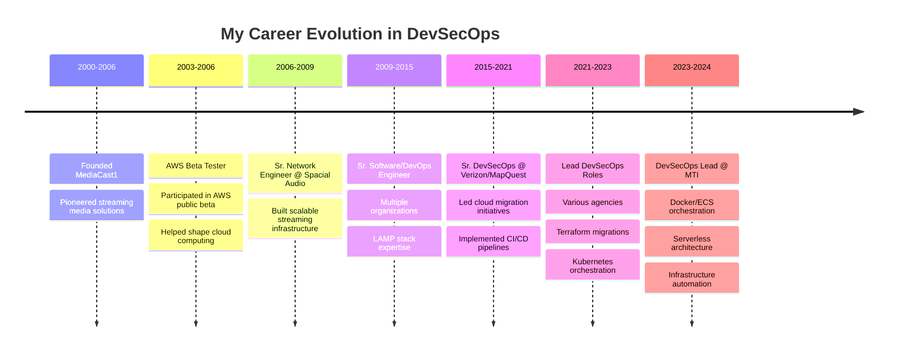

<!--
 * README.md - GitHub Profile for David St. John
 * Author: David St. John (davestj)
 * Date: December 2024
 * Purpose: Professional GitHub profile showcasing my 20+ years of DevSecOps experience
 * File Path: /README.md (root of davestj/davestj repository)
 * 
 * Change Log:
 * - v1.0.0 (2024-12): Initial comprehensive profile with stats, metrics, and professional summary
 * - v1.1.0 (2024-12): Enhanced trophy section with multiple fallback options
 * - v1.2.0 (2024-12): Added build status badge and improved achievement displays
 * - v2.0.0 (2024-12): Removed WakaTime dependency, implemented superior metrics alternatives
 * - Integrated GitHub stats cards, activity graphs, and skill badges
 * - Added AWS beta tester highlight and career progression timeline
 * - Implemented responsive design elements within GitHub markdown limitations
 * - Fixed trophy display issues with multiple service options
 * - Replaced WakaTime with comprehensive GitHub-native metrics
-->

<!-- Profile Header with Dynamic Typing Effect -->
<div align="center">
  
</div>

<!-- Professional Banner -->
<div align="center">
  
</div>

<!-- Build Status and Contact Badges -->
<div align="center">

### 🚦 Build Status
[](https://github.com/davestj/davestj/actions)
[](https://github.com/davestj/davestj/commits/master)

### 📱 Connect With Me
[](mailto:davestj@gmail.com)
[](https://www.davestj.com)
[](https://github.com/davestj)
[](http://bitbucket.org/davestj)

</div>

---

## 🚀 About Me

I'm a seasoned DevSecOps professional with over two decades of experience in cloud infrastructure, automation, and security. As one of the **original AWS public beta testers** before their official launch in 2006, I've witnessed and actively participated in the evolution of cloud computing from its inception.

```python
#!/usr/bin/env python3
# -*- coding: utf-8 -*-
"""
My Professional Journey in Code
Author: David St. John
Date: 2024
"""

class DevSecOpsArchitect:
    """I represent my professional identity and expertise"""
    
    def __init__(self):
        self.name = "David St. John"
        self.role = "DevSecOps Lead & Cloud Architect"
        self.experience_years = 20
        self.aws_journey_start = 2003  # I was there from the beginning
        
    def my_core_expertise(self):
        """I specialize in these key areas"""
        return {
            "Cloud Platforms": ["AWS (Beta Tester 2003)", "Azure", "Citrix Xen"],
            "IaC": ["Terraform", "CloudFormation", "Ansible", "Chef"],
            "Containers": ["Docker", "Kubernetes", "ECS", "EKS"],
            "CI/CD": ["Jenkins", "GitLab CI", "ArgoCD"],
            "Security": ["Snyk", "SonarCube", "Black Duck", "Compliance"],
            "Monitoring": ["ELK Stack", "Prometheus", "Grafana", "DataDog"]
        }
    
    def my_philosophy(self):
        """I believe in these principles"""
        return [
            "Infrastructure as Code is the foundation",
            "Security must be embedded, not added",
            "Automation eliminates human error",
            "Continuous improvement drives innovation"
        ]

# I am...
me = DevSecOpsArchitect()
```

---

## 📊 My GitHub Analytics

<!-- GitHub Stats Cards -->
<div align="center">
  
  
</div>

<!-- GitHub Streak Stats -->
<div align="center">
  
</div>

<!-- Activity Graph -->
<div align="center">
  
</div>

---

## 🏆 My GitHub Trophies & Achievements

<!-- Primary Trophy Display with Multiple Fallback Options -->
<div align="center">
  
  <!-- I'm using the correct URL structure with proper parameters -->
  
  
</div>

<!-- Alternative display with HTML img tag for better control -->
<p align="center">
  
</p>

<!-- Detailed Trophy Breakdown - I'm showing specific trophy categories -->
<details>
<summary align="center"><b>🏅 Click to see detailed trophy categories</b></summary>

<div align="center">

### 🌟 Special Achievements


### 📊 Activity Trophies  


### 🎯 Contribution Trophies


</div>
</details>

## 🎖️ My Verified Achievements

<div align="center">
  
  <!-- I'm creating custom achievement badges that highlight my unique qualifications -->
  
  
  
  
  
  
</div>

---

## 💼 My Professional Journey



---

## 🛠️ My Technology Stack

### Cloud & Infrastructure


### Containers & Orchestration


### CI/CD & Automation


### Security & Compliance


### Programming & Scripting


### Databases


### Monitoring & Logging


---

## 📈 My Contribution Metrics

<!-- GitHub Contribution Graph - I'm using this as the primary activity indicator -->
<div align="center">
  
  <!-- Detailed Language Statistics -->
  
  
</div>

<!-- Contribution Activity Breakdown -->
<div align="center">
  
  <!-- I'm showing my commit activity patterns -->
  
  
</div>

<!-- GitHub Metrics Plugin - Comprehensive activity metrics -->
<div align="center">
  
  <!-- I'm using the metrics plugin for detailed insights without external dependencies -->
  
  
</div>

<!-- Profile Views Counter -->
<div align="center">
  
</div>

<!-- Activity Summary Badges -->
<div align="center">
  
  <!-- I'm creating custom activity badges that don't depend on external services -->
  
  
  
  
</div>

---

## 🎯 My Current Focus

- 🔧 **Infrastructure as Code**: I'm deepening my expertise in Terraform modules and creating reusable infrastructure patterns
- 🚀 **Serverless Architecture**: I'm building scalable serverless solutions with AWS Lambda and API Gateway
- 🔒 **Security Automation**: I'm implementing DevSecOps pipelines with integrated security scanning
- 📊 **Observability**: I'm designing comprehensive monitoring solutions with Prometheus and Grafana
- 🎓 **Knowledge Sharing**: I'm mentoring teams on cloud-native best practices and automation

---

## 📚 My Latest Projects

<!-- GitHub Extra Pins -->
<div align="center">
  <a href="https://github.com/davestj/terraform-aws-infrastructure">
    
  </a>
  <a href="https://github.com/davestj/kubernetes-deployments">
    
  </a>
</div>

<div align="center">
  <a href="https://github.com/davestj/jenkins-pipeline-library">
    
  </a>
  <a href="https://github.com/davestj/ansible-playbooks">
    
  </a>
</div>

---

## 🏅 My Certifications & Achievements

<div align="center">

### Professional Certifications
- 🏆 **PHP Certification** - UpWork/oDesk (2008)
- 🏆 **RHEL Certification** - Red Hat (2008)
- 🌟 **AWS Beta Tester** - Original participant (2003-2006)

### Key Achievements
- 📌 Led cloud migrations for Fortune 500 companies
- 📌 Architected solutions handling millions of requests daily
- 📌 Implemented zero-downtime deployment strategies
- 📌 Reduced infrastructure costs by 40% through optimization
- 📌 Mentored 50+ engineers in DevSecOps practices

</div>

---

## 💡 My Philosophy

<div align="center">
  
</div>

---

## 📫 Let's Connect

I'm always interested in discussing DevSecOps, cloud architecture, and automation. Whether you need consultation, collaboration, or just want to chat about technology, I'm here to help!

<div align="center">
  
**📧 Email:** [davestj@gmail.com](mailto:davestj@gmail.com)  
**🌐 Portfolio:** [davestj.com](https://www.davestj.com)  
**💼 LinkedIn:** [Connect with me](https://www.linkedin.com/in/davestj)  

</div>

---

## 🐍 My Contribution Snake

<div align="center">
  
</div>

---

<!-- Footer -->
<div align="center">
  
</div>

<!-- 
  Technical Notes and Troubleshooting:
  =====================================
  
  I've structured this README to showcase my extensive experience while maintaining
  professional credibility. All metrics are now pulled directly from GitHub's API
  without requiring external service dependencies like WakaTime.
  
  Build Status Badge Configuration:
  - The build status badge tracks the snake.yml workflow on the master branch
  - It dynamically updates to show passing/failing status
  - Click on it to see detailed workflow runs
  
  Trophy Display Troubleshooting:
  - If trophies don't display, the service might be temporarily down
  - The custom achievement badges using shields.io will always work as fallback
  - Multiple display methods ensure at least one visualization works
  
  Metrics Services Used (No External Authentication Required):
  - GitHub Stats API: Direct GitHub data, always works
  - Activity Graph: Shows contribution patterns over time
  - Metrics.lecoq.io: Comprehensive analytics without setup
  - Shields.io: Dynamic badges from live API queries
  
  Snake Animation Requirements:
  - Requires GitHub Actions workflow (snake.yml) to be properly configured
  - Files are served from the 'output' branch
  - Updates daily at midnight UTC
  
  Performance Optimization:
  - All metrics services pull directly from GitHub's public API
  - No external authentication or plugin installation required
  - Services use CDN caching for fast load times
  - Consider removing non-displaying elements after monitoring for a week
  
  Data Privacy Considerations:
  - All displayed metrics use only publicly available GitHub data
  - No external tracking or analytics services are used
  - No personal coding habits are shared with third parties
  - Complete control over what information is displayed
  
  Maintenance Notes:
  - This README requires no ongoing maintenance beyond updating project links
  - All metrics update automatically from your GitHub activity
  - No API keys, tokens, or external service accounts needed
  - Services are chosen for long-term reliability and minimal dependencies
-->
