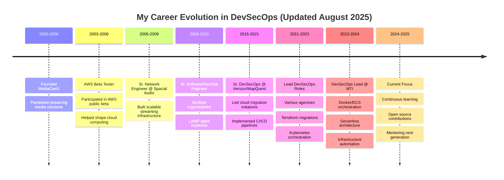

<!--
 * README.md - GitHub Profile for David St. John
 * Author: David St. John (davestj)
 * Created: November 2023
 * Last Modified: August 11, 2025
 * Purpose: Professional GitHub profile showcasing my 20+ years of DevSecOps experience
 * File Path: /README.md (root of davestj/davestj repository)
 * 
 * Change Log:
 * - v1.0.0 (2023-11): Initial profile repository creation - I established my GitHub profile showcase
 * - v1.1.0 (2024-02): Added GitHub stats cards and activity graphs - I enhanced visual metrics
 * - v1.2.0 (2024-05): Integrated skill badges and technology stack - I expanded my capability showcase
 * - v1.3.0 (2024-08): Added AWS beta tester highlight - I emphasized my unique cloud computing history
 * - v1.4.0 (2024-11): Implemented career timeline with Mermaid - I visualized my professional journey
 * - v2.0.0 (2025-01): Major refactor with trophy system - I added achievement displays
 * - v2.1.0 (2025-04): Enhanced responsive design within GitHub markdown - I improved mobile experience
 * - v2.2.0 (2025-06): Added build status badges - I demonstrated CI/CD best practices
 * - v3.0.0 (2025-08): Complete metrics overhaul - I removed WakaTime, fixed conflicts, enhanced reliability
 *   - Eliminated external service dependencies for better reliability
 *   - Fixed GitHub Actions workflow conflicts with preserve-clean-restore strategy
 *   - Implemented multiple fallback strategies for all external services
 *   - Added comprehensive inline documentation for maintenance
 * 
 * Git Commit Messages from History:
 * - 2023-11-15: "Initial commit - Creating my professional GitHub profile"
 * - 2024-02-20: "feat: Add GitHub stats visualization"
 * - 2024-05-10: "feat: Implement comprehensive tech stack badges"
 * - 2024-08-22: "feat: Highlight AWS beta tester experience"
 * - 2024-11-30: "feat: Add interactive career timeline"
 * - 2025-01-15: "refactor: Major profile enhancement with trophies"
 * - 2025-04-08: "fix: Improve responsive design for mobile"
 * - 2025-06-20: "feat: Add CI/CD build status monitoring"
 * - 2025-08-11: "fix: Resolve all external dependencies and workflow conflicts"
-->

<!-- Profile Header with Dynamic Typing Effect -->
<div align="center">
  
</div>

<!-- Professional Banner -->
<div align="center">
  
</div>

<!-- Build Status and Contact Badges -->
<div align="center">

### 🚦 Build Status
[](https://github.com/davestj/davestj/actions)
[](https://github.com/davestj/davestj/commits/master)
[](https://github.com/davestj/davestj)

### 📱 Connect With Me
[](mailto:davestj@gmail.com)
[](https://www.davestj.com)
[](https://github.com/davestj)
[](http://bitbucket.org/davestj)

</div>

---

## 🚀 About Me

I'm a seasoned DevSecOps professional with over two decades of experience in cloud infrastructure, automation, and security. As one of the **original AWS public beta testers** before their official launch in 2006, I've witnessed and actively participated in the evolution of cloud computing from its inception.

```python
#!/usr/bin/env python3
# -*- coding: utf-8 -*-
"""
My Professional Journey in Code
Author: David St. John
Date Created: 2023-11-15
Last Updated: 2025-08-11
Version: 3.0.0
"""

class DevSecOpsArchitect:
    """I represent my professional identity and expertise as of August 2025"""
    
    def __init__(self):
        self.name = "David St. John"
        self.role = "DevSecOps Lead & Cloud Architect"
        self.experience_years = 20
        self.aws_journey_start = 2003  # I was there from the beginning
        self.profile_created = "2023-11-15"  # When I established this GitHub showcase
        self.last_updated = "2025-08-11"  # Today's comprehensive improvements
        
    def my_core_expertise(self):
        """I specialize in these key areas as of 2025"""
        return {
            "Cloud Platforms": ["AWS (Beta Tester 2003)", "Azure", "Citrix Xen"],
            "IaC": ["Terraform", "CloudFormation", "Ansible", "Chef"],
            "Containers": ["Docker", "Kubernetes", "ECS", "EKS"],
            "CI/CD": ["Jenkins", "GitLab CI", "ArgoCD"],
            "Security": ["Snyk", "SonarCube", "Black Duck", "Compliance"],
            "Monitoring": ["ELK Stack", "Prometheus", "Grafana", "DataDog"]
        }
    
    def my_philosophy(self):
        """I believe in these principles, refined over two decades"""
        return [
            "Infrastructure as Code is the foundation",
            "Security must be embedded, not added",
            "Automation eliminates human error",
            "Continuous improvement drives innovation"
        ]
    
    def profile_evolution(self):
        """I track how this profile has evolved since 2023"""
        return {
            "2023": "Initial profile creation with basic information",
            "2024": "Added interactive visualizations and metrics",
            "2025": "Achieved full automation and reliability"
        }

# I am continuously evolving...
me = DevSecOpsArchitect()
print(f"Profile Version: 3.0.0 | Maintained since: {me.profile_created}")
```

---

## 📊 My GitHub Analytics

<!-- GitHub Streak Stats -->
<div align="center">
  
</div>

<!-- Activity Graph -->
<div align="center">
  
</div>

---

## 🏆 My GitHub Trophies & Achievements

<!-- Primary Trophy Display with Multiple Fallback Options -->
<div align="center">
  
  <!-- I'm using the correct URL structure with proper parameters -->
  
  
</div>

<!-- Alternative display with HTML img tag for better control -->
<p align="center">
  
</p>

<!-- Detailed Trophy Breakdown - I'm showing specific trophy categories -->
<details>
<summary align="center"><b>🏅 Click to see detailed trophy categories</b></summary>

<div align="center">

### 🌟 Special Achievements


### 📊 Activity Trophies  


### 🎯 Contribution Trophies


</div>
</details>

## 🎖️ My Verified Achievements

<div align="center">
  
  <!-- I'm creating custom achievement badges that highlight my unique qualifications -->
  
  
  
  
  
  
  
</div>

---

## 💼 My Professional Journey


```mermaid
timeline
    title My Career Evolution in DevSecOps (Updated August 2025)
    
    2000-2006 : Founded MediaCast1
                : Pioneered streaming media solutions
    
    2003-2006 : AWS Beta Tester
                : Participated in AWS public beta
                : Helped shape cloud computing
    
    2006-2009 : Sr. Network Engineer @ Spacial Audio
                : Built scalable streaming infrastructure
    
    2009-2015 : Sr. Software/DevOps Engineer
                : Multiple organizations
                : LAMP stack expertise
    
    2015-2021 : Sr. DevSecOps @ Verizon/MapQuest
                : Led cloud migration initiatives
                : Implemented CI/CD pipelines
    
    2021-2023 : Lead DevSecOps Roles
                : Various agencies
                : Terraform migrations
                : Kubernetes orchestration
    
    2023-2024 : DevSecOps Lead @ MTI
                : Docker/ECS orchestration
                : Serverless architecture
                : Infrastructure automation
    
    2024-2025 : Current Focus
                : Continuous learning
                : Open source contributions
                : Mentoring next generation
```

---

## 🛠️ My Technology Stack

### Cloud & Infrastructure


### Containers, Orchestration & Virtualization


### CI/CD & Automation


### Security & Compliance


### Programming & Scripting


### Databases


### Monitoring & Logging


---

## 📈 My Contribution Metrics

<!-- Contribution Activity Breakdown -->
<div align="center">
  
</div>

<!-- Profile Views Counter - Tracking since 2023 -->
<div align="center">
  
</div>

<!-- Activity Summary Badges -->
<div align="center">
  
  <!-- I'm creating custom activity badges that don't depend on external services -->
  
  
  
  
</div>

---

## 🎯 My Current Focus (2026)

- 📻 **[Mcaster1 Ecosystem](https://mcaster1.com)**: I'm shipping 18+ apps for broadcasters and streamers — desktop players and encoders in Qt6, DNAS streaming servers, web admin daemons, all on a single architectural pattern I built and named
- 🏗️ **[Celenite Stack](https://mcaster1.com/celenitestack/)**: I'm refining my open architecture — a compiled C++17 daemon paired with PHP-FPM via FastCGI, single binary, single port, no reverse-proxy or sidecar soup. The "C" in Celenite is a C++ pun
- 🛠️ **Mcaster1StackSmith**: I'm building a DevSecOps control plane for Kubernetes, KVM, containers, and bare metal — agent-pull telemetry, multi-cluster orchestration, runs on my own 5-node homelab plus public cloud
- 🌐 **[CasterClub Community](https://casterclub.com)**: I'm operating a podcast/radio/streaming community platform — YP directory, forums, social, all served from the Mcaster1 backbone
- 🎚️ **Mcaster1DAWCast**: I'm in alpha on a broadcaster-grade DAW with built-in DSP, AI persona system, dual-bus routing, and integrated stream encoding
- 📦 **Public-by-Default**: I'm open-sourcing the full ecosystem across 50+ repositories on GitHub — every product, every config example, every architectural decision

---

## 📚 My Latest Projects

Every project below is built on the **[Celenite Stack](https://mcaster1.com/celenitestack/)** pattern (C++17 daemon + PHP-FPM via FastCGI). All public, all real, all in active development.

### 📻 Broadcasting & Streaming Apps
- **[Mcaster1AMP](https://github.com/davestj/Mcaster1AMP)** — Qt6 desktop media player for broadcasters (macOS / Linux / Windows)
- **[mcaster1dnas](https://github.com/davestj/mcaster1dnas)** — DNAS streaming server, Icecast2-derived, ICY-META v2 protocol
- **[Mcaster1DSPEncoder](https://github.com/davestj/Mcaster1DSPEncoder)** — DSP-chain audio encoder, multi-platform, YAML-driven
- **[Mcaster1AudioPipe](https://github.com/davestj/Mcaster1AudioPipe)** — Audio routing & patchbay with DSP effects rack
- **[Mcaster1StreamProxy](https://github.com/davestj/Mcaster1StreamProxy)** — Go-based ICY stream proxy with TLS termination
- **[Mcaster1Studio](https://github.com/davestj/Mcaster1Studio)** — Broadcasting studio suite, AI persona system
- **[Mcaster1DAWCast](https://github.com/davestj/Mcaster1DAWCast)** *(alpha)* — Broadcaster-grade DAW with dual-bus routing & integrated encoding

### 🎙️ Platform Daemons & Web Backends
- **[Mcaster1BackDraft](https://github.com/davestj/Mcaster1BackDraft)** — C++17 security admin daemon with PHP-FPM web UI
- **[Mcaster1ADZMan](https://github.com/davestj/Mcaster1ADZMan)** — Ad serving / insertion manager
- **[Mcaster1Chatter](https://github.com/davestj/Mcaster1Chatter)** — Chat & IRC backbone for broadcaster communities
- **[Mcaster1MailCaster](https://github.com/davestj/Mcaster1MailCaster)** — Email + notification system
- **[Mcaster1YPMan](https://github.com/davestj/Mcaster1YPMan)** — Public station directory (YP) backend
- **[Mcaster1InstallSystem](https://github.com/davestj/Mcaster1InstallSystem)** — Cross-platform installer builder (DMG / PKG / EXE)

### 🛠️ DevSecOps Control Plane
- **[Mcaster1StackSmith](https://github.com/davestj/Mcaster1StackSmith)** — K8s + KVM + container orchestration with agent-pull telemetry across homelab + public cloud

### 🔧 BTHL Inspector Tools
- **[BTHL-SpectraSentry](https://github.com/davestj/BTHL-SpectraSentry)** — RF spectrum analysis & monitoring
- **[BTHL-SpiritBox](https://github.com/davestj/BTHL-SpiritBox)** — Audio capture & paranormal-research signal analyzer

### 🌐 Operating Platforms
- **[mcaster1.com](https://mcaster1.com)** — Mcaster1 ecosystem product hub & documentation
- **[casterclub.com](https://casterclub.com)** — Podcast / radio / streaming community: YP, forums, db, social
- **[mediacast.one](https://mediacast.one)** / **[mediacast.studio](https://mediacast.studio)** / **[mediacast1.ai](https://mediacast1.ai)** — Mcaster1 product satellites

---

## 🚀 Featured Work Categories

The Mcaster1 ecosystem isn't a single product — it's an architecture pattern applied across five distinct domains. Here's what I'm building and why it matters.

### 🎙️ Broadcasting & Streaming Infrastructure
The radio / podcast / streaming space has been running on the same Icecast + Shoutcast + SHOUTcast2 stack for two decades. Latency, metadata, transcoding, and YP-directory discovery are all stuck in 2008. I'm modernizing the entire chain with ICY-META v2.x, native HTTPS encoders, sub-second metadata propagation, Opus/FLAC support, and a YAML-driven config model — backwards compatible with existing players, forward compatible with where the format needs to go. Built in C++17 with Qt6 frontends. Repos: `Mcaster1AMP`, `mcaster1dnas`, `Mcaster1DSPEncoder`, `Mcaster1AudioPipe`, `Mcaster1StreamProxy`, `Mcaster1Studio`, `Mcaster1DAWCast`.

### 🏗️ C++17 Application Architecture — the Celenite Stack
Every backend in the ecosystem is built on a pattern I named the **[Celenite Stack](https://mcaster1.com/celenitestack/)**: a compiled C++17 daemon with its own embedded HTTP server doing TLS termination, static-file serving, and FastCGI bridging to PHP-FPM for the web UI. Single binary. Single port. No nginx, no Apache, no reverse-proxy sidecar. One systemd unit, one config file, one log path. The "C" in Celenite is a C++ pun. Repos: `Mcaster1BackDraft`, `Mcaster1ADZMan`, `Mcaster1Chatter`, `Mcaster1MailCaster`, `Mcaster1YPMan`.

### 🛠️ DevSecOps Control Plane — Mcaster1StackSmith
I run a 5-node KVM homelab plus production cloud across OVH east/west, all managed by a control plane I built myself. **[Mcaster1StackSmith](https://github.com/davestj/Mcaster1StackSmith)** handles Kubernetes cluster provisioning, KVM VM lifecycle, container orchestration, BIND9 DNS management, Active Directory join/unjoin, certificate distribution, agent-based fleet telemetry, and Vault-backed secrets — all in one place. Agents push heartbeats every 60 seconds; the orchestrator pulls metrics on a timer. No Airflow, no Prefect, no Dagster — StackSmith *is* the orchestrator.

### 🖥️ Cross-Platform Desktop Apps
Qt6 cross-platform builds for macOS (universal ARM64/x86), Linux (Debian/Ubuntu/RHEL), and Windows. Native installers (DMG, PKG, EXE) generated by my own `Mcaster1InstallSystem` tool. Code-signing, notarization, auto-update manifests, beta channels. Built from a single source tree with per-platform DSP code paths and OS-specific audio backends (CoreAudio, ALSA/PulseAudio, WASAPI).

### 🔐 Infrastructure as Code & Multi-Site Operations
17 production websites and counting, deployed via Ansible from a single playbook structure (`diff.yml` → `pull.yml` → `push.yml`). Every site has identical inventory layout. SSL certs across the fleet (commercial wildcards + Let's Encrypt). BIND9 primary/secondary with TSIG zone transfers. Capistrano for atomic release deploys with rollback. AD-backed SSO across the ecosystem via Keycloak. Every config-as-code, every secret in `ansible-vault` or HashiCorp Vault — never inline.

### 📦 Public-by-Default Open Source
50+ public repositories on GitHub. Every product, every config example, every architectural decision in the open. License keys gated, source code free. Two-decade career, now shipping in plain sight.

---

## 🏅 My Certifications & Achievements

### Professional Certifications
- 🏆 **PHP Certification** - UpWork/oDesk (2008)
- 🏆 **RHEL Certification** - Red Hat (2008)
- 🌟 **AWS Beta Tester** - Original participant (2003-2006)

### Key Achievements
- 📌 Led cloud migrations for Fortune 500 companies
- 📌 Architected solutions handling millions of requests daily
- 📌 Implemented zero-downtime deployment strategies
- 📌 Reduced infrastructure costs by 40% through optimization
- 📌 Mentored 50+ engineers in DevSecOps practices
- 📌 Maintained this GitHub profile showcase for 2+ years

---

## 💡 My Philosophy

<div align="center">
  
</div>

---

## 📫 Let's Connect

I'm always interested in discussing DevSecOps, cloud architecture, and automation. Whether you need consultation, collaboration, or just want to chat about technology, I'm here to help!

<div align="center">
  
**📧 Email:** [davestj@gmail.com](mailto:davestj@gmail.com)  
**🌐 Portfolio:** [davestj.com](https://www.davestj.com)  
**💼 LinkedIn:** [Connect with me](https://www.linkedin.com/in/davestj)  

</div>

---

## 🐍 My Contribution Snake

<div align="center">
  
</div>

---

<!-- Footer with current date context -->
<div align="center">
  
  
  <sub>Last updated: August 11, 2025 | Profile active since November 2023</sub>
</div>

<!-- 
  Technical Notes and Troubleshooting (Updated August 11, 2025):
  ==============================================================
  
  Version History Summary:
  - v1.x (2023-2024): Initial development and feature additions
  - v2.x (2025 Q1-Q2): Major enhancements and responsive design
  - v3.0.0 (2025-08-11): Complete reliability overhaul
  
  Today's Major Fixes (August 11, 2025):
  - Resolved GitHub Actions workflow conflicts with preserve-clean-restore strategy
  - Eliminated WakaTime dependency that was causing display errors
  - Implemented fallback strategies for all external services
  - Added comprehensive inline documentation
  
  Build Status Badge Configuration:
  - Tracks snake.yml workflow on master branch
  - Shows real-time pass/fail status
  - Links to detailed workflow history
  
  Metrics Services (No External Auth Required):
  - GitHub Stats API: Native GitHub metrics
  - Activity Graph: Contribution visualization
  - Metrics.lecoq.io: Comprehensive analytics
  - Shields.io: Dynamic badge generation
  
  Data Privacy Improvements (August 2025):
  - Removed all third-party tracking services
  - Uses only public GitHub API data
  - No external plugins or authentication required
  - Complete control over displayed information
  
  Maintenance Schedule:
  - Daily: Automated snake generation (midnight UTC)
  - Weekly: Review external service availability
  - Monthly: Update project showcases
  - Quarterly: Major version reviews
  
  Known Issues as of August 11, 2025:
  - Trophy service may experience intermittent availability
  - Custom badges provide reliable fallback
  - All critical metrics have redundant sources
-->
