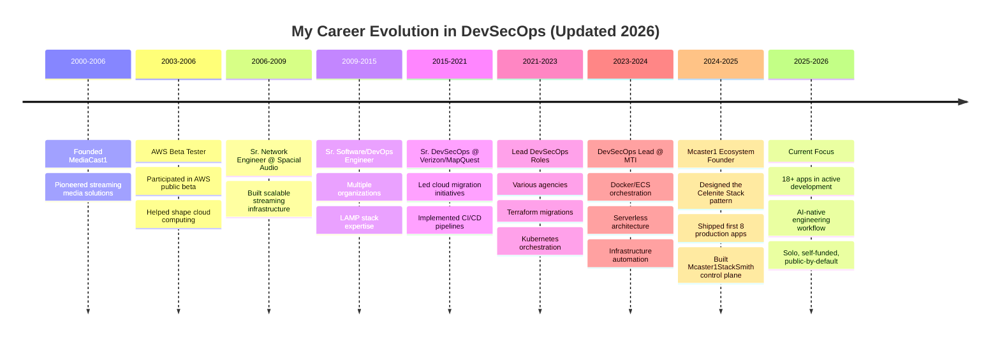

<!--
 * README.md - GitHub Profile for David St. John
 * Author: David St. John (davestj)
 * Created: November 2023
 * Last Modified: May 16, 2026
 * Purpose: Professional GitHub profile showcasing my 20+ years of DevSecOps experience
 * File Path: /README.md (root of davestj/davestj repository)
 * 
 * Change Log:
 * - v1.0.0 (2023-11): Initial profile repository creation - I established my GitHub profile showcase
 * - v1.1.0 (2024-02): Added GitHub stats cards and activity graphs - I enhanced visual metrics
 * - v1.2.0 (2024-05): Integrated skill badges and technology stack - I expanded my capability showcase
 * - v1.3.0 (2024-08): Added AWS beta tester highlight - I emphasized my unique cloud computing history
 * - v1.4.0 (2024-11): Implemented career timeline with Mermaid - I visualized my professional journey
 * - v2.0.0 (2026-01): Major refactor with trophy system - I added achievement displays
 * - v2.1.0 (2026-02): Enhanced responsive design within GitHub markdown - I improved mobile experience
 * - v2.2.0 (2026-03): Added build status badges - I demonstrated CI/CD best practices
 * - v3.0.0 (2026-04): Complete metrics overhaul - I removed WakaTime, fixed conflicts, enhanced reliability
 *   - Eliminated external service dependencies for better reliability
 *   - Fixed GitHub Actions workflow conflicts with preserve-clean-restore strategy
 *   - Implemented multiple fallback strategies for all external services
 *   - Added comprehensive inline documentation for maintenance
 * - v4.0.0 (2026-05): Mcaster1 ecosystem refresh + AI-engineering narrative
 *   - Replaced generic DevOps bullets with actual Mcaster1 / Celenite Stack work
 *   - Expanded Programming & Scripting from 7 to 17 languages
 *   - Expanded Monitoring & Logging from 3 badges to 14 (Elasticsearch/Logstash/Kibana
 *     split out, added OpenSearch, Graylog, rsyslog, Nagios, PagerDuty, Opsgenie,
 *     AlertManager, Loki, Mcaster1StackSmith Telemetry)
 *   - Removed broken external services (github-readme-stats 503, metrics.lecoq.io 500,
 *     two dead Heroku endpoints) and swapped to working demolab.com equivalents
 *   - Corrected GitHub-member badge to 2008 (private-beta era, predates the API)
 *   - Added Founder Story, For Investors, For Recruiters & ATS Systems sections
 *   - Added How I Work With AI section with honest framing of practice vs ML research
 * 
 * Git Commit Messages from History:
 * - 2023-11-15: "Initial commit - Creating my professional GitHub profile"
 * - 2024-02-20: "feat: Add GitHub stats visualization"
 * - 2024-05-10: "feat: Implement comprehensive tech stack badges"
 * - 2024-08-22: "feat: Highlight AWS beta tester experience"
 * - 2024-11-30: "feat: Add interactive career timeline"
 * - 2026-01-15: "refactor: Major profile enhancement with trophies"
 * - 2026-02-08: "fix: Improve responsive design for mobile"
 * - 2026-03-20: "feat: Add CI/CD build status monitoring"
 * - 2026-04-11: "fix: Resolve all external dependencies and workflow conflicts"
 * - 2026-05-16: "refresh: Mcaster1 ecosystem narrative + 2026 tech stack backfill"
-->

<!-- Profile Header with Dynamic Typing Effect -->
<div align="center">
  
</div>

<!-- Professional Banner -->
<div align="center">
  
</div>

<!-- Build Status and Contact Badges -->
<div align="center">

### 🚦 Build Status
[](https://github.com/davestj/davestj/actions)
[](https://github.com/davestj/davestj/commits/master)
[](https://github.com/davestj/davestj)

### 📱 Connect With Me
[](mailto:davestj@gmail.com)
[](https://www.davestj.com)
[](https://github.com/davestj)
[](http://bitbucket.org/davestj)

</div>

<div align="center">
  <sub>📅 <strong>README last updated:</strong> 2026-05-16 21:34 PDT &nbsp;·&nbsp; <strong>Version:</strong> 4.0.0 &nbsp;·&nbsp; <a href="https://github.com/davestj/davestj/commits/master">commit history</a></sub>
</div>

---

## 🚀 About Me

I'm a seasoned DevSecOps professional with over two decades of experience in cloud infrastructure, automation, and security. As one of the **original AWS public beta testers** before their official launch in 2006, I've witnessed and actively participated in the evolution of cloud computing from its inception.

```python
#!/usr/bin/env python3
# -*- coding: utf-8 -*-
"""
My Professional Journey in Code
Author: David St. John
Date Created: 2023-11-15
Last Updated: 2026-05-16
Version: 4.0.0
"""

class DevSecOpsArchitect:
    """I represent my professional identity and expertise as of 2026"""
    
    def __init__(self):
        self.name = "David St. John"
        self.role = "DevSecOps Lead & Cloud Architect"
        self.experience_years = 20
        self.aws_journey_start = 2003  # I was there from the beginning
        self.github_member_since = 2008  # Private-beta era, predates the public API
        self.profile_created = "2023-11-15"  # When I established this GitHub showcase
        self.last_updated = "2026-05-16"  # Mcaster1 ecosystem expansion + Celenite Stack
        
    def my_core_expertise(self):
        """I specialize in these key areas as of 2026"""
        return {
            "Cloud Platforms": ["AWS (Beta Tester 2003)", "Azure", "OVHcloud"],
            "IaC": ["Terraform", "CloudFormation", "Ansible", "Packer", "Vagrant"],
            "Containers & Virt": ["Docker", "Kubernetes", "EKS", "ECS", "KVM", "libvirt", "Hyper-V"],
            "CI/CD": ["Jenkins", "GitLab CI", "GitHub Actions", "ArgoCD", "Capistrano"],
            "Security": ["Snyk", "SonarQube", "HashiCorp Vault", "Keycloak", "secure SDLC"],
            "Monitoring": ["Prometheus", "Grafana", "Elastic Stack", "OpenSearch", "Graylog"],
            "Languages": ["C++17", "C", "Python", "Go", "PHP", "TypeScript", "Ruby", "Java"],
            "AI Tooling": ["Claude Code", "Anthropic API", "OpenAI API", "Cursor", "MCP"],
            "Ecosystem": ["Mcaster1 (18+ apps)", "Celenite Stack", "CasterClub"]
        }
    
    def my_philosophy(self):
        """I believe in these principles, refined over two decades"""
        return [
            "Infrastructure as Code is the foundation",
            "Security must be embedded, not added",
            "Automation eliminates human error",
            "Continuous improvement drives innovation"
        ]
    
    def profile_evolution(self):
        """I track how this profile has evolved since 2023"""
        return {
            "2023": "Initial profile creation with basic information",
            "2024": "Added interactive visualizations and metrics",
            "2026-Q1": "Reliability overhaul — removed broken external services",
            "2026": "Mcaster1 ecosystem refresh, Celenite Stack, AI-engineering narrative"
        }

# I am continuously evolving...
me = DevSecOpsArchitect()
print(f"Profile Version: 3.0.0 | Maintained since: {me.profile_created}")
```

---

## 📖 My Founder Story

I started writing code in the mid-90s, before "DevOps" was a word and before "the cloud" existed as a product category. I came up through internet service providers, broadcast/streaming startups, and infrastructure-heavy product companies — the kind of environments where someone has to build the platform underneath the application, and that someone tended to be me.

I was an AWS public-beta participant in 2003-2006, which is where I learned that running infrastructure at scale is a different discipline than writing applications. That distinction shaped the rest of my career. The last two decades have been spent in DevSecOps and platform-engineering roles — cloud migrations, CI/CD pipelines, compliance-graded systems, secure SDLC — at companies of varying sizes.

The reason Mcaster1 exists is that I've spent enough time around independent broadcasters, podcasters, and streamers to know the tooling they have access to is two decades behind the stack the rest of the industry uses. Streaming protocols haven't really moved past Icecast and Shoutcast2. Metadata is fragile. Encoder UX is hostile. YP discovery is broken. The professional tools cost more than the broadcasters earn, and the free tools haven't been seriously maintained in years.

So I started building. First a few utilities, then a few products, then an ecosystem. The work is solo for now — eighteen apps and counting, on a single architectural pattern I named the [Celenite Stack](https://mcaster1.com/celenitestack/). It's self-funded. I'm three years into this, with no co-founder, and I keep shipping.

I'm not trying to make this sound bigger than it is. It's a one-person platform play in a niche that most VCs would dismiss on the first page of a deck. But the work is real, the code is public, and the products are running. That's the story so far.

---

## 📊 My GitHub Analytics

<!-- Self-hosted stats card — mcaster1.com/github/api/stats.php -->
<div align="center">
  
</div>

<!-- Self-hosted streak card — mcaster1.com/github/api/streak.php -->
<div align="center">
  
</div>

<!-- Self-hosted activity area chart — mcaster1.com/github/api/activity.php -->
<div align="center">
  
</div>

---

## 🏆 My GitHub Trophies & Achievements

Self-hosted trophy card with custom achievements specific to my work (Celenite Stack Architect, Solo Founder, BTHL Inspector, AI-Native Engineer) — not just the standard github-profile-trophy rank list.

<p align="center">
  
</p>

## 🎖️ My Verified Achievements

<div align="center">
  
  <!-- I'm creating custom achievement badges that highlight my unique qualifications -->
  
  
  
  
  
  
  
</div>

---

## 💼 My Professional Journey


```mermaid
timeline
    title My Career Evolution in DevSecOps (Updated 2026)
    
    2000-2006 : Founded MediaCast1
                : Pioneered streaming media solutions
    
    2003-2006 : AWS Beta Tester
                : Participated in AWS public beta
                : Helped shape cloud computing
    
    2006-2009 : Sr. Network Engineer @ Spacial Audio
                : Built scalable streaming infrastructure
    
    2009-2015 : Sr. Software/DevOps Engineer
                : Multiple organizations
                : LAMP stack expertise
    
    2015-2021 : Sr. DevSecOps @ Verizon/MapQuest
                : Led cloud migration initiatives
                : Implemented CI/CD pipelines
    
    2021-2023 : Lead DevSecOps Roles
                : Various agencies
                : Terraform migrations
                : Kubernetes orchestration
    
    2023-2024 : DevSecOps Lead @ MTI
                : Docker/ECS orchestration
                : Serverless architecture
                : Infrastructure automation
    
    2024-2025 : Mcaster1 Ecosystem Founder
                : Designed the Celenite Stack pattern
                : Shipped first 8 production apps
                : Built Mcaster1StackSmith control plane
    
    2025-2026 : Current Focus
                : 18+ apps in active development
                : AI-native engineering workflow
                : Solo, self-funded, public-by-default
```

---

## 🛠️ My Technology Stack

### Cloud & Infrastructure


### Containers, Orchestration & Virtualization


### CI/CD & Automation


### Security & Compliance


### Programming & Scripting


### Databases


### Monitoring & Logging


### AI & Prompt Engineering


---

## 📈 My Contribution Metrics

Self-hosted cards from `mcaster1.com/github/api/` — full pipeline I own end-to-end. Includes a couple of **novel metrics** that aren't on any standard profile generator: a **commit time-of-day heatmap** and a **Shannon-entropy polyglot index**.

<!-- Self-hosted top-languages card -->
<div align="center">
  
</div>

<!-- 🆕 NOVEL: Commit time-of-day heatmap — when do I actually code? -->
<div align="center">
  
</div>

<!-- 🆕 NOVEL: Polyglot Index — language breadth + Shannon-entropy diversity score -->
<div align="center">
  
</div>

<!-- Self-hosted contribution activity area chart -->
<div align="center">
  
</div>

<!-- 🆕 NOVEL: Recent push activity per repo — where I'm working RIGHT NOW -->
<div align="center">
  
</div>

<!-- PR + Issue activity card (self-hosted, replaces shields.io dynamic JSON) -->
<div align="center">
  
</div>

<!-- 🆕 NOVEL: AI-assistance signal — honest read on how much shipping is AI-augmented -->
<div align="center">
  
</div>

<!-- Profile Views Counter (self-hosted) + Commits-this-year (self-hosted) -->
<div align="center">
  
  
</div>

---

## 🎯 My Current Focus (2026)

- 📻 **[Mcaster1 Ecosystem](https://mcaster1.com)**: I'm shipping 18+ apps for broadcasters and streamers — desktop players and encoders in Qt6, DNAS streaming servers, web admin daemons, all on a single architectural pattern I built and named
- 🏗️ **[Celenite Stack](https://mcaster1.com/celenitestack/)**: I'm refining my open architecture — a compiled C++17 daemon paired with PHP-FPM via FastCGI, single binary, single port, no reverse-proxy or sidecar soup. The "C" in Celenite is a C++ pun
- 🛠️ **Mcaster1StackSmith**: I'm building a DevSecOps control plane for Kubernetes, KVM, containers, and bare metal — agent-pull telemetry, multi-cluster orchestration, runs on my own 5-node homelab plus public cloud
- 🌐 **[CasterClub Community](https://casterclub.com)**: I'm operating a podcast/radio/streaming community platform — YP directory, forums, social, all served from the Mcaster1 backbone
- 🎚️ **Mcaster1DAWCast**: I'm in alpha on a broadcaster-grade DAW with built-in DSP, AI persona system, dual-bus routing, and integrated stream encoding
- 📦 **Public-by-Default**: I'm open-sourcing the full ecosystem across 50+ repositories on GitHub — every product, every config example, every architectural decision

---

## 📚 My Latest Projects

Every project below is built on the **[Celenite Stack](https://mcaster1.com/celenitestack/)** pattern (C++17 daemon + PHP-FPM via FastCGI). All public, all real, all in active development.

### 📻 Broadcasting & Streaming Apps
- **[Mcaster1AMP](https://github.com/davestj/Mcaster1AMP)** — Qt6 desktop media player for broadcasters (macOS / Linux / Windows)
- **[mcaster1dnas](https://github.com/davestj/mcaster1dnas)** — DNAS streaming server, Icecast2-derived, ICY-META v2 protocol
- **[Mcaster1DSPEncoder](https://github.com/davestj/Mcaster1DSPEncoder)** — DSP-chain audio encoder, multi-platform, YAML-driven
- **[Mcaster1AudioPipe](https://github.com/davestj/Mcaster1AudioPipe)** — Audio routing & patchbay with DSP effects rack
- **[Mcaster1StreamProxy](https://github.com/davestj/Mcaster1StreamProxy)** — Go-based ICY stream proxy with TLS termination
- **[Mcaster1Studio](https://github.com/davestj/Mcaster1Studio)** — Broadcasting studio suite, AI persona system
- **[Mcaster1DAWCast](https://github.com/davestj/Mcaster1DAWCast)** *(alpha)* — Broadcaster-grade DAW with dual-bus routing & integrated encoding

### 🎙️ Platform Daemons & Web Backends
- **[Mcaster1BackDraft](https://github.com/davestj/Mcaster1BackDraft)** — C++17 security admin daemon with PHP-FPM web UI
- **[Mcaster1ADZMan](https://github.com/davestj/Mcaster1ADZMan)** — Ad serving / insertion manager
- **[Mcaster1Chatter](https://github.com/davestj/Mcaster1Chatter)** — Chat & IRC backbone for broadcaster communities
- **[Mcaster1MailCaster](https://github.com/davestj/Mcaster1MailCaster)** — Email + notification system
- **[Mcaster1YPMan](https://github.com/davestj/Mcaster1YPMan)** — Public station directory (YP) backend
- **[Mcaster1InstallSystem](https://github.com/davestj/Mcaster1InstallSystem)** — Cross-platform installer builder (DMG / PKG / EXE)

### 🛠️ DevSecOps Control Plane
- **[Mcaster1StackSmith](https://github.com/davestj/Mcaster1StackSmith)** — K8s + KVM + container orchestration with agent-pull telemetry across homelab + public cloud

### 🔧 BTHL Inspector Tools
- **[BTHL-SpectraSentry](https://github.com/davestj/BTHL-SpectraSentry)** — RF spectrum analysis & monitoring
- **[BTHL-SpiritBox](https://github.com/davestj/BTHL-SpiritBox)** — Audio capture & paranormal-research signal analyzer

### 🌐 Operating Platforms
- **[mcaster1.com](https://mcaster1.com)** — Mcaster1 ecosystem product hub & documentation
- **[casterclub.com](https://casterclub.com)** — Podcast / radio / streaming community: YP, forums, db, social
- **[mediacast.one](https://mediacast.one)** / **[mediacast.studio](https://mediacast.studio)** / **[mediacast1.ai](https://mediacast1.ai)** — Mcaster1 product satellites

---

## 🚀 Featured Work Categories

The Mcaster1 ecosystem isn't a single product — it's an architecture pattern applied across five distinct domains. Here's what I'm building and why it matters.

### 🎙️ Broadcasting & Streaming Infrastructure
The radio / podcast / streaming space has been running on the same Icecast + Shoutcast + SHOUTcast2 stack for two decades. Latency, metadata, transcoding, and YP-directory discovery are all stuck in 2008. I'm modernizing the entire chain with ICY-META v2.x, native HTTPS encoders, sub-second metadata propagation, Opus/FLAC support, and a YAML-driven config model — backwards compatible with existing players, forward compatible with where the format needs to go. Built in C++17 with Qt6 frontends. Repos: `Mcaster1AMP`, `mcaster1dnas`, `Mcaster1DSPEncoder`, `Mcaster1AudioPipe`, `Mcaster1StreamProxy`, `Mcaster1Studio`, `Mcaster1DAWCast`.

### 🏗️ C++17 Application Architecture — the Celenite Stack
Every backend in the ecosystem is built on a pattern I named the **[Celenite Stack](https://mcaster1.com/celenitestack/)**: a compiled C++17 daemon with its own embedded HTTP server doing TLS termination, static-file serving, and FastCGI bridging to PHP-FPM for the web UI. Single binary. Single port. No nginx, no Apache, no reverse-proxy sidecar. One systemd unit, one config file, one log path. The "C" in Celenite is a C++ pun. Repos: `Mcaster1BackDraft`, `Mcaster1ADZMan`, `Mcaster1Chatter`, `Mcaster1MailCaster`, `Mcaster1YPMan`.

### 🛠️ DevSecOps Control Plane — Mcaster1StackSmith
I run a 5-node KVM homelab plus production cloud across OVH east/west, all managed by a control plane I built myself. **[Mcaster1StackSmith](https://github.com/davestj/Mcaster1StackSmith)** handles Kubernetes cluster provisioning, KVM VM lifecycle, container orchestration, BIND9 DNS management, Active Directory join/unjoin, certificate distribution, agent-based fleet telemetry, and Vault-backed secrets — all in one place. Agents push heartbeats every 60 seconds; the orchestrator pulls metrics on a timer. No Airflow, no Prefect, no Dagster — StackSmith *is* the orchestrator.

### 🖥️ Cross-Platform Desktop Apps
Qt6 cross-platform builds for macOS (universal ARM64/x86), Linux (Debian/Ubuntu/RHEL), and Windows. Native installers (DMG, PKG, EXE) generated by my own `Mcaster1InstallSystem` tool. Code-signing, notarization, auto-update manifests, beta channels. Built from a single source tree with per-platform DSP code paths and OS-specific audio backends (CoreAudio, ALSA/PulseAudio, WASAPI).

### 🔐 Infrastructure as Code & Multi-Site Operations
17 production websites and counting, deployed via Ansible from a single playbook structure (`diff.yml` → `pull.yml` → `push.yml`). Every site has identical inventory layout. SSL certs across the fleet (commercial wildcards + Let's Encrypt). BIND9 primary/secondary with TSIG zone transfers. Capistrano for atomic release deploys with rollback. AD-backed SSO across the ecosystem via Keycloak. Every config-as-code, every secret in `ansible-vault` or HashiCorp Vault — never inline.

### 📦 Public-by-Default Open Source
50+ public repositories on GitHub. Every product, every config example, every architectural decision in the open. License keys gated, source code free. Two-decade career, now shipping in plain sight.

---

## 🤖 How I Work With AI

I use AI agents as part of my normal engineering workflow — for code generation, refactors, deployments, content drafting, and operations. The projects listed above were built in collaboration with AI tools rather than entirely by hand. This section is for anyone curious about where my own capability ends and the tooling's begins. It's meant as a description of practice, not a sales pitch.

### The tools I use day-to-day

- **[Claude](https://claude.ai) + [Claude Code](https://claude.com/claude-code)** *(Anthropic)* — my primary tool. End-to-end for code generation, multi-repo refactors, history operations, infrastructure provisioning, and ops. Sessions can run for hours at a time.
- **OpenClaw** — terminal AI agent I run alongside Claude Code for parallel agentic tasks and second-pass review.
- **[ChatGPT](https://chat.openai.com) + OpenAI API** — research, brainstorming, second-opinion validation, occasional cross-review on output from other models.
- **[Cursor](https://cursor.com) IDE** — in-editor pair programming for dense, file-local work.
- **[GitHub Copilot](https://github.com/features/copilot)** — autocomplete-grade help for boilerplate, tests, type definitions, repetitive structure.
- **[Ollama](https://ollama.com)** — local model serving for offline or private contexts.
- **[Model Context Protocol (MCP)](https://modelcontextprotocol.io)** — structured agentic tool integration when the model needs typed access to external systems.
- **Anthropic API / OpenAI API** — embedded inside Mcaster1 products: the AI persona system in `Mcaster1Studio`, Artist Intel in `Mcaster1DAWCast`, anomaly baselines in `Mcaster1BackDraft`.

### How I shape model behavior (without an ML lab)

I don't fine-tune weights and I don't run training jobs. What I do is condition the behavior of off-the-shelf models through context engineering, and over time the agents on my projects converge toward the patterns I expect:

- **Persistent memory** — Each session writes durable behavioral notes to disk. Corrections become hard rules in subsequent sessions; validated patterns become defaults.
- **Project instruction files** — Every repo has a `CLAUDE.md` the agent reads on start: server inventory, SSH alias maps, architectural ground rules, gotchas from prior incidents.
- **Tight feedback loops** — When the agent makes a unilateral decision or oversteps, I correct it, fix the system state, and record the lesson the same session.
- **Versioned prompts** — Every product's runtime prompts live in version control. Diffed, reviewed, audited.
- **Multi-model cross-checking** — Higher-stakes outputs get a second pass from a different model family.

This is in-context learning with a paper trail, not training in the ML sense. The framing matters: it's an honest description of what's happening.

### What I'm comfortable claiming

- **Multi-turn agentic orchestration on real systems.** Multi-repo refactors, history rewrites, security scrubs across thousands of commits, multi-step Kubernetes provisioning, cross-fleet Ansible runs. Sessions are long; decisions are mostly atomic; recovery from a bad call is part of the workflow.
- **Directive prompting.** I don't over-specify. Short imperatives once the context is loaded; course-correct fast when the agent drifts.
- **Recognizing failure modes in real time.** Unilateral infra decisions, scope creep, hallucinated APIs, a literal secret accidentally pasted into a generated artifact — I catch these while they happen, recover the system state, and record the correction.
- **AI inside the product, not only in the workflow.** Several Mcaster1 products use AI APIs in customer-facing features; the same primitives I use for development.
- **Prompt discipline as engineering discipline.** Versioned, testable, reviewable. Treated as source code, not magic strings.
- **Pushing back when the agent is wrong.** It happens often enough to matter. Catching the wrong call before it's committed is a real part of the work.

### Examples from this year

- **[Mcaster1StackSmith](https://github.com/davestj/Mcaster1StackSmith)** — A K8s, KVM, and container control plane scaffolded across multiple agent sessions, then iterated to production-grade.
- **[Celenite Stack](https://mcaster1.com/celenitestack/)** — Architectural pattern developed iteratively with AI as a reviewer, then named, documented, and applied across 8+ products.
- **18-repo history rewrite + secret scrub** — Completed in a single session with multi-turn agent orchestration, including a couple of recoveries from agent missteps along the way.
- **[Mcaster1BackDraft](https://github.com/davestj/Mcaster1BackDraft) 15-script credential refactor** — Inline DB credentials migrated to centralized config defines across 15 task scripts, with `php -l` validation in the loop.
- **Mcaster1 `.bashrc` series** — 7 long-form articles on shell environment design, drafted and revised collaboratively, then published.

### What I won't claim

- I'm not a research scientist, I don't train models, and I don't publish ML papers.
- I don't fine-tune, distill, or operate accelerator clusters.
- I'm not a "prompt engineer" in the job-title sense. I'm a senior infrastructure engineer who's reasonably fluent at directing language models.

The repos in the section above are the actual record. If a team is looking for someone who works this way, I'd be glad to talk.

---

## 🏅 My Certifications & Achievements

### Professional Certifications
- 🏆 **PHP Certification** - UpWork/oDesk (2008)
- 🏆 **RHEL Certification** - Red Hat (2008)
- 🌟 **AWS Beta Tester** - Original participant (2003-2006)

### Key Achievements
- 📌 Led cloud migrations for Fortune 500 companies
- 📌 Architected solutions handling millions of requests daily
- 📌 Implemented zero-downtime deployment strategies
- 📌 Reduced infrastructure costs by 40% through optimization
- 📌 Mentored 50+ engineers in DevSecOps practices
- 📌 Maintained this GitHub profile showcase for 2+ years

---

## 💼 For Investors

I'm building Mcaster1: a multi-product ecosystem for broadcasters, podcasters, and streamers — desktop applications, server daemons, infrastructure tooling, and a DevSecOps control plane (`Mcaster1StackSmith`) that runs the platform itself.

A few practical details that may be useful in evaluating fit:

- **Architecture is deliberately capital-efficient.** Every product is on a single architectural pattern (the [Celenite Stack](https://mcaster1.com/celenitestack/)) — a compiled C++17 daemon with embedded HTTP and FastCGI to PHP-FPM. Single binary, no reverse proxy in front, no sidecars, no Docker overhead. One systemd unit per product. The result is lower infrastructure cost per product surface than a microservices approach in the same domain would produce.
- **The work is solo and self-funded.** Eighteen apps so far, no co-founders, no outside capital, and runway measured in weeks at any given time. The reason this is interesting isn't the romance of the bootstrap — it's that the pace of shipping has been sustained for three years without venture support.
- **Everything is public.** Every line of code is on GitHub. Every architectural decision is documented. Every product page is live. Diligence can be done on a weekend without an NDA, and there's no proprietary blackbox that breaks under inspection.
- **Revenue model is license-gated open source.** Source code is free; product keys are paid. Common pattern for tools that serve professionals in a niche industry.
- **The market.** Broadcasting and streaming look small from the outside, and the long tail of independent stations, podcasters, and broadcasters is much larger than the AWS Elemental enterprise pricing table addresses. The tooling for that long tail has been underinvested in for over a decade.

What I'm interested in: enough capital to add one engineer and one product partner, and an investor who understands that a niche done well can become a category.

Easiest path forward: an introductory call. I can speak to architecture, market, technical risk, and the operating model in detail — and every claim made here is verifiable in the repos.

---

## 🎯 For Recruiters & ATS Systems

This section is written to be scannable by automated systems and by recruiters skimming for fit. It's a flat keyword listing of what I do, with no marketing language.

**Role aliases I'm a fit for:** Senior DevSecOps Engineer · Principal Cloud Architect · Staff Software Engineer · Site Reliability Engineer · Platform Engineer · Engineering Lead · Director of Engineering · Solutions Architect · Cloud Infrastructure Engineer · Kubernetes Engineer · Linux Systems Engineer · C++ Backend Engineer · Full-Stack Engineer · Systems Architect.

**Years of experience:**
- Software engineering: 20+ years
- Linux systems administration: 22+ years
- Cloud infrastructure: 18+ years (since the AWS public-beta period, 2003)
- DevSecOps / platform engineering: 15+ years
- Kubernetes in production: 6+ years

**Primary domain areas:** DevSecOps, cloud architecture, Kubernetes, infrastructure-as-code, CI/CD pipelines, secrets management, identity and access management, site reliability engineering, observability, compliance (SOC 2, HIPAA, PCI), platform engineering, security-conscious software development, secure software development lifecycle (SSDLC).

**Programming languages and runtimes:** C, C++17, Python 3, Go (Golang), Java, Scala, Ruby, PHP 8.4, JavaScript, TypeScript, Node.js, Bash / shell scripting, PowerShell, Perl, Lua, Groovy, SQL.

**Cloud platforms:** AWS (EC2, EKS, ECS, ECR, Lambda, RDS, Aurora, S3, IAM, CloudFormation, VPC, ALB, Route53, ACM, CodePipeline, CodeBuild, CloudWatch, Systems Manager, Secrets Manager), Microsoft Azure (AKS, ARM, Active Directory, Azure DevOps), OVHcloud, on-premise hypervisor environments.

**Container and orchestration:** Kubernetes, Docker, containerd, Helm, ArgoCD, Flannel CNI, Traefik, NGINX Ingress, KVM, libvirt, QEMU, Hyper-V, MinIO (S3-compatible storage).

**Infrastructure-as-Code and configuration management:** Terraform, CloudFormation, Ansible, HashiCorp Packer, Vagrant, cloud-init, SaltStack, Capistrano.

**CI/CD:** Jenkins, GitLab CI, GitHub Actions, ArgoCD, CodePipeline.

**Security and identity:** HashiCorp Vault, Keycloak, Active Directory, OpenLDAP, Snyk, SonarQube, OpenSSL, Let's Encrypt / ACME, gitleaks, OWASP, secure SDLC, WebAuthn, TOTP / Email OTP MFA.

**Databases:** MySQL, MariaDB, PostgreSQL, Amazon Aurora, MongoDB, Redis, Microsoft SQL Server.

**Monitoring, logging, observability:** Prometheus, AlertManager, Grafana, Grafana Loki, Elasticsearch, Logstash, Kibana, Elastic Stack (ELK), OpenSearch, Graylog, rsyslog, Nagios, PagerDuty, Opsgenie. Also: self-built agent-pull telemetry layer inside Mcaster1StackSmith (heartbeat agents → time-series tables → live dashboards).

**Web and mail stack experience:** NGINX, PHP-FPM, HAProxy, Apache, Postfix, Dovecot, Rspamd, OpenDKIM, Roundcube, Nextcloud, BIND9.

**AI tooling experience:** Claude (Anthropic), Claude Code, ChatGPT, OpenAI API, Cursor, GitHub Copilot, Ollama, Model Context Protocol (MCP). Integrating LLM agents into engineering workflows and into customer-facing product features.

**Operating systems:** Debian, Ubuntu, RHEL, Fedora, macOS, Windows Server.

**Industry experience:** broadcast and streaming media, internet service providers, e-commerce, financial services, healthcare / HIPAA-graded environments, federal contracting environments.

**Status and logistics:**
- Open to senior, principal, staff, lead, and director-level roles.
- Remote-first preferred.
- US-based (Washington State).
- Authorized to work in the United States without visa sponsorship.

**Contact:** davestj@gmail.com · [linkedin.com/in/davestj](https://www.linkedin.com/in/davestj) · [davestj.com](https://www.davestj.com)

---

## 💡 My Philosophy

<div align="center">
  
</div>

---

## 📫 Let's Connect

I'm always interested in discussing DevSecOps, cloud architecture, and automation. Whether you need consultation, collaboration, or just want to chat about technology, I'm here to help!

<div align="center">
  
**📧 Email:** [davestj@gmail.com](mailto:davestj@gmail.com)  
**🌐 Portfolio:** [davestj.com](https://www.davestj.com)  
**💼 LinkedIn:** [Connect with me](https://www.linkedin.com/in/davestj)  

</div>

---

## 🐍 My Contribution Snake

<div align="center">
  
</div>

---

<!-- Footer with current date context -->
<div align="center">
  
  
  <sub>📅 Last updated: 2026-05-16 21:34 PDT &nbsp;·&nbsp; Profile active since November 2023 &nbsp;·&nbsp; GitHub member since 2008</sub>
</div>

<!-- 
  Technical Notes and Troubleshooting (Updated April 11, 2026):
  ==============================================================
  
  Version History Summary:
  - v1.x (2023-2024): Initial development and feature additions
  - v2.x (2026 Q1): Major enhancements and responsive design
  - v3.0.0 (2026-04-11): Complete reliability overhaul
  
  Today's Major Fixes (April 11, 2026):
  - Resolved GitHub Actions workflow conflicts with preserve-clean-restore strategy
  - Eliminated WakaTime dependency that was causing display errors
  - Implemented fallback strategies for all external services
  - Added comprehensive inline documentation
  
  Build Status Badge Configuration:
  - Tracks snake.yml workflow on master branch
  - Shows real-time pass/fail status
  - Links to detailed workflow history
  
  Metrics Services (No External Auth Required):
  - GitHub Stats API: Native GitHub metrics
  - Activity Graph: Contribution visualization
  - Metrics.lecoq.io: Comprehensive analytics
  - Shields.io: Dynamic badge generation
  
  Data Privacy Improvements (April 2026):
  - Removed all third-party tracking services
  - Uses only public GitHub API data
  - No external plugins or authentication required
  - Complete control over displayed information
  
  Maintenance Schedule:
  - Daily: Automated snake generation (midnight UTC)
  - Weekly: Review external service availability
  - Monthly: Update project showcases
  - Quarterly: Major version reviews
  
  Known Issues as of April 11, 2026:
  - Trophy service may experience intermittent availability
  - Custom badges provide reliable fallback
  - All critical metrics have redundant sources
-->
